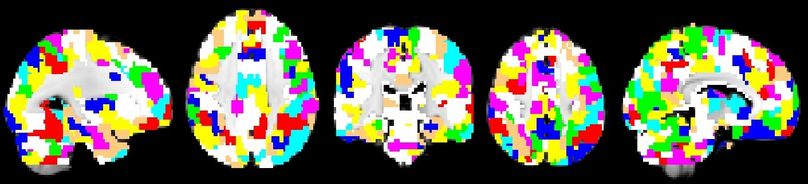

.. _parcelattion_mask:

Parcellation mask
*****************

The JDE framework estimates **HRF parcels-wide**. This means that you need a
parcellation mask to compute the estimation-detection. PyHRF provides some
:doc:`tools <commands>` to generate parcellation masks and provides also a
parcellation mask.

Willard atlas
+++++++++++++

The Willard atlas comes from
`Stanford <http://findlab.stanford.edu/functional_ROIs.html>`_.

|

|

To use it check where it is installed by using:

.. code:: bash

    $ pyhrf_list_datafiles

and check for ``stanford_willard_parcellation_3x3x3mm.nii.gz`` file.

This parcellation mask has been created from the files distributed by
Stanford (above website) with a voxel resolution of 3x3x3mm and a volume shape
of 53x63x52 voxels.

The citation for the 499 fROI atlas, nicknamed the "Willard" atlas after the two
creators, **Will**\ iam Shirer and Bern\ **ard** Ng, is the following publication:

    Richiardi, J., Altmann, A., Milazzo, A.-C., Chang, C., Chakravarty, M. M.,
    Banaschewski, T., … Tahmasebi, A. (2015). Correlated gene expression supports
    synchronous activity in brain networks. Science, 348(6240), 1241–1244. https://doi.org/10.1126/science.1255905
